# Практическая работа №13
## Профилирование Go-приложения (pprof). Измерение времени работы функций
### Саттаров Булат Рамилевич, ЭФМО-01-25

---
## 1. Цель работы и краткое описание стенда

**Цель работы:** выявить узкое место по производительности в обработчике запроса и ускорить работу сервиса на основе результатов профилирования.

**Стенд:**
- OS: MAC OS
- CPU: Apple M3 Pro

**Структура проекта (ключевые файлы):**
- `cmd/api/main.go` — запуск HTTP-сервера + подключение `net/http/pprof`
- `internal/work/slow.go` — медленная реализация `Fib(n)` (рекурсивная)
- `internal/work/fast.go` — оптимизированная реализация `FibFast(n)` (итеративная)
- `internal/work/timer.go` — ручной таймер (логирование времени выполнения)
- `internal/work/slow_test.go` — бенчмарки (`go test -bench -benchmem`)
- `docs/screenshots/` — скриншоты результатов (pprof, hey, benchmarks, timers)

---

## 2. CPU-профиль: top + graph/web

### 2.1 `pprof top` (до)
По CPU-профилю видно, что почти всё время уходит в `singularity.com/pprof-lab/internal/work.Fib` — **~96%**:

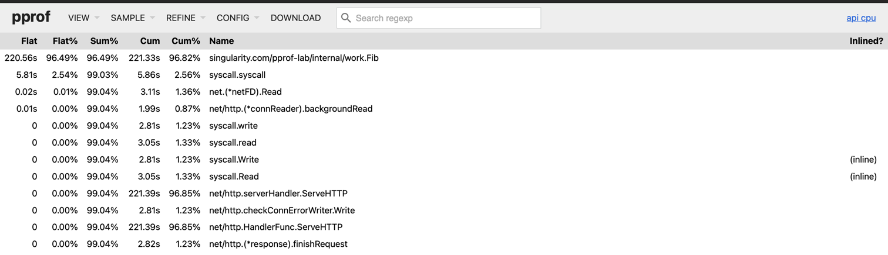

### 2.2 `pprof graph/web` (до)
Граф вызовов: цепочка HTTP-обработчика заканчивается в `work.Fib`:

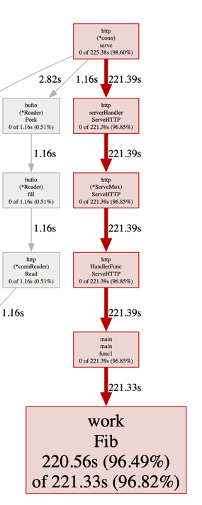

---
### 2.3 `pprof top` (после)
После оптимизации в pprof top больше нет доминирования work.Fib: основное время уходит в syscall.syscall, runtime.kevent/usleep и прочие runtime-функции. Значит, вычисление Fibonacci перестало быть узким местом.
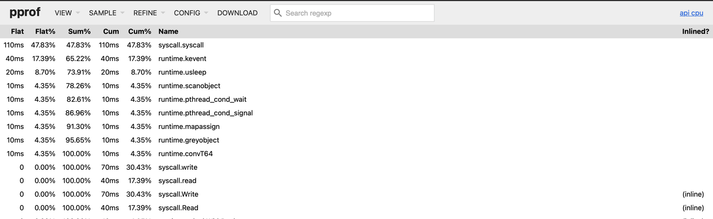
### 2.4 `pprof graph/web` (после)
На pprof graph/web видно то же самое: цепочка вызовов больше не “упирается” в тяжёлую функцию, а проходит через системные/служебные вызовы. Теперь производительность endpoint’а ограничена накладными расходами HTTP/рантайма, а не алгоритмом.
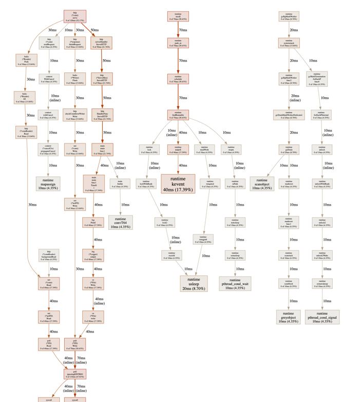

## 3. Heap-профиль (краткий анализ)

### 3.1 `alloc_space`
По heap-профилю в alloc_space основная часть аллокаций связана с обработкой HTTP-запроса и инфраструктурой:
- `net/http.readRequest`
- `net/textproto.MIMEHeader.Set`
- `net/http.Header.Clone`
- `net/textproto.readMIMEHeader`
- `net/url.parse`

То есть в данном проекте память выделяется в основном не в вычислении Fibonacci, а при парсинге HTTP-заголовков/запроса и в служебных функциях.

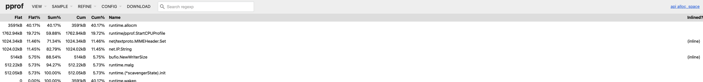

После оптимизации (с точки зрения памяти) картина не меняется принципиально — аллокации всё ещё в основном “вокруг HTTP”:

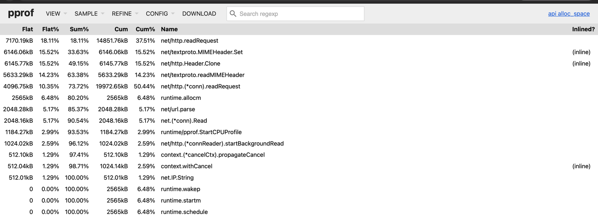

### 3.2 `inuse_space`
Inuse-профиль показывает текущие “живые” объекты; доминируют runtime/служебные структуры:

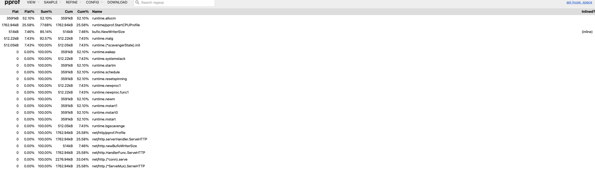  
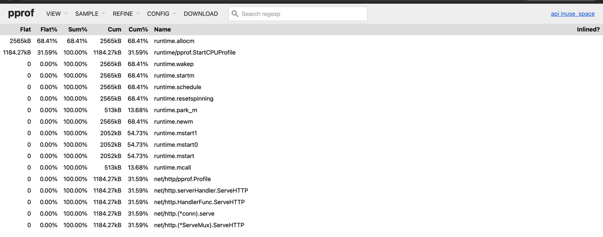

---

## 4. Ручные таймеры и бенчмарки (до/после)

### 4.1 Логи ручных таймеров
До оптимизации время вычисления `Fib(38)` порядка **~150–166 мс**:

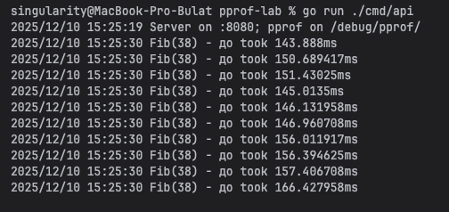

После оптимизации (`FibFast(38)`) — **микросекунды/наносекунды**:

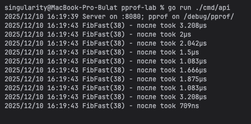

### 4.2 Бенчмарки `-bench -benchmem` (до/после)

Команда:
```bash
go test ./internal/work -bench=. -benchmem
```

**До:**
- `BenchmarkFib-11`: **2 378 417 ns/op**, `0 B/op`, `0 allocs/op`

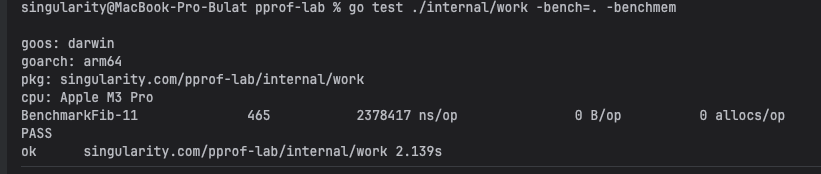

**После:**
- `BenchmarkFibFast-11`: **9.217 ns/op**, `0 B/op`, `0 allocs/op`

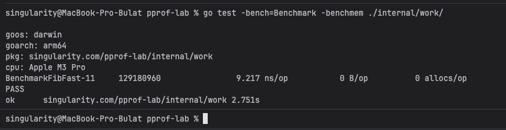

---

## 5. Описание внесённых изменений

**Было:** рекурсивная реализация Fibonacci `Fib(n)` с экспоненциальной сложностью

**Стало:** `FibFast(n)` со сложностью **O(n)** (без рекурсии и без повторных вычислений).

---

## 6. Сравнительная таблица метрик до/после

### 6.1 Бенчмарк-метрики
| Метрика | До (Fib) | После (FibFast) |
|---|---:|---:|
| ns/op | 2 378 417 | 9.217 |
| B/op | 0 | 0 |
| allocs/op | 0 | 0 |

### 6.2 Нагрузочное тестирование
Команда:
```bash
hey -n 5000 -c 20 http://localhost:8080/work
```

**До:**
- RPS: **65.2575**
- p95: **0.3739 s**
- p99: **0.4203 s**
- error rate: **0%**

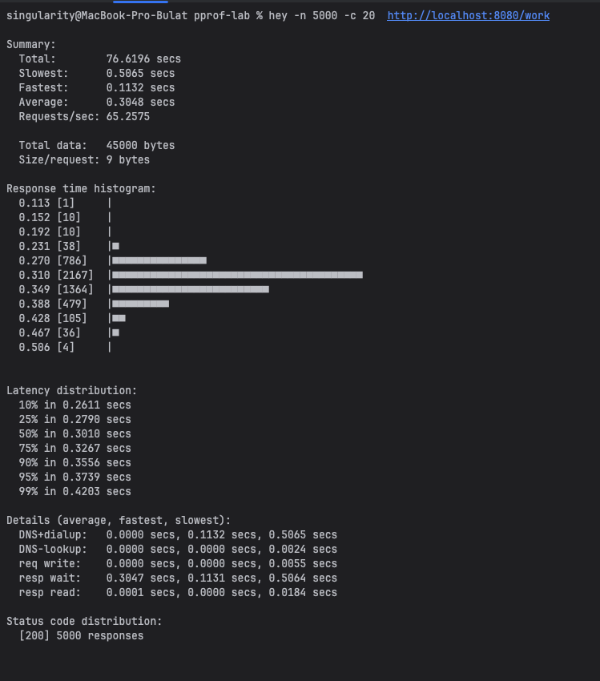

**После:**
- RPS: **64405.1859**
- p95: **0.0006 s**
- p99: **0.0010 s**
- error rate: **0%**

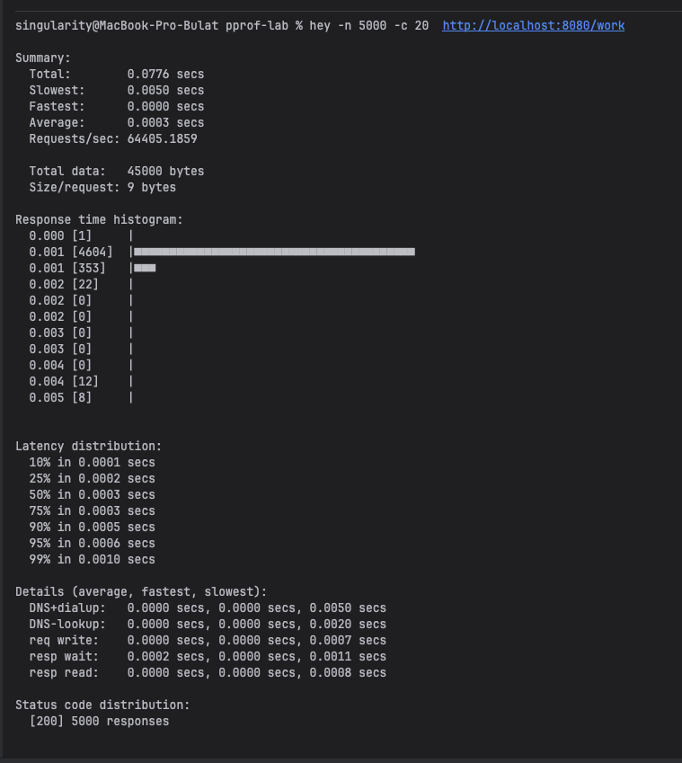

---

## 7. Выводы

- **Узкое место:** CPU-профиль показал, что **~96%** времени тратилось в `work.Fib` (рекурсия).
- **Чем помогла оптимизация:** замена на `work.FibFast` убрала экспоненциальные вычисления и дала резкий рост производительности:
    - бенчмарк ускорился примерно в **~258 000 раз** (2 378 417 ns/op → 9.217 ns/op),
    - в нагрузочном тесте RPS вырос примерно в **~987 раз** (65 → 64k),
    - аллокации не увеличились (`0 B/op`, `0 allocs/op`).
---

